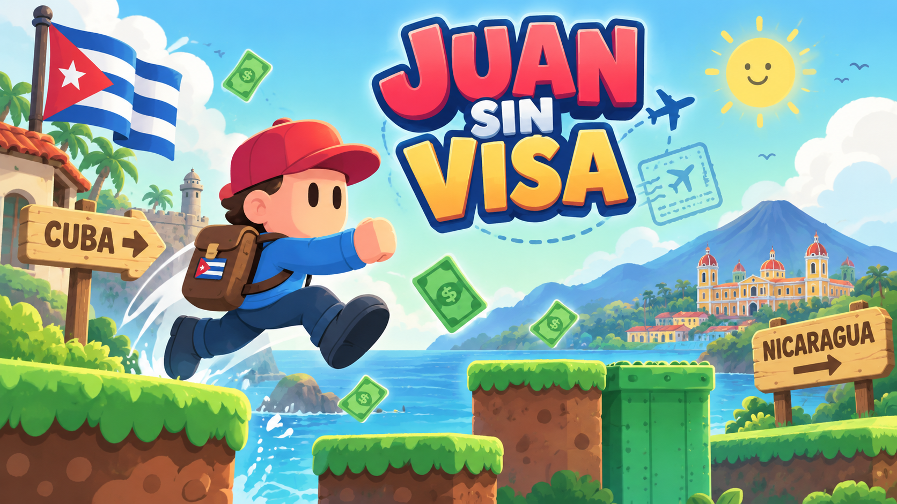
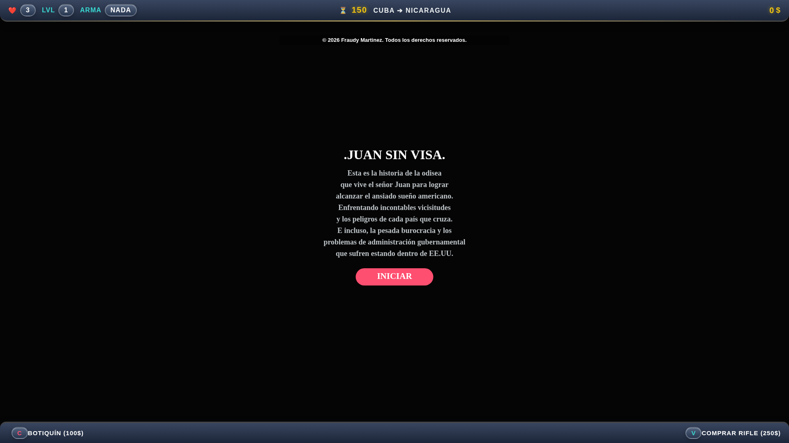
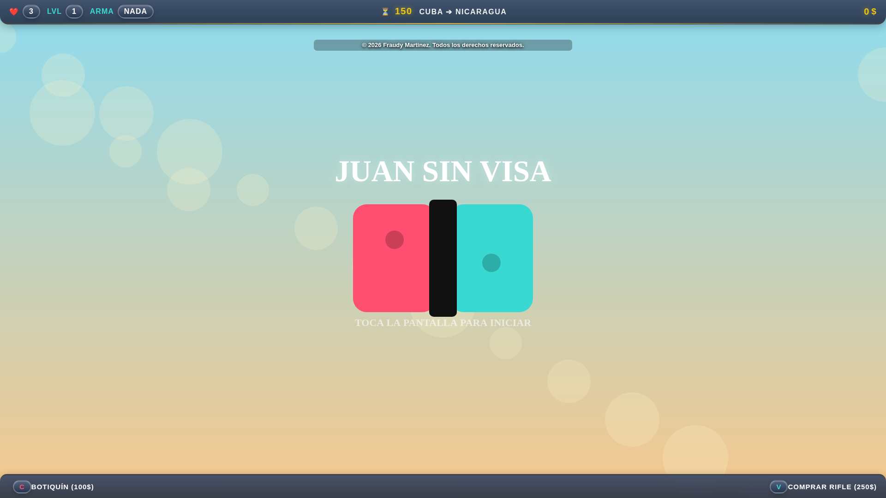
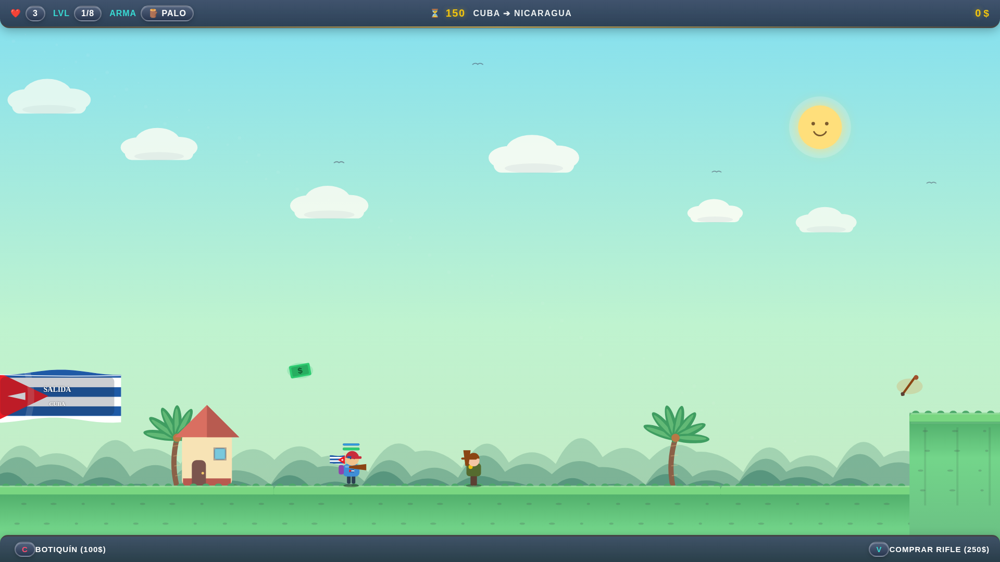
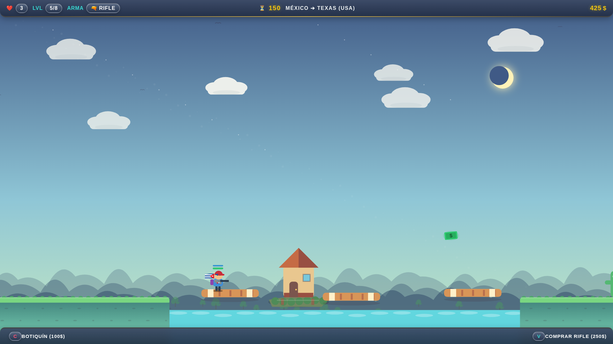
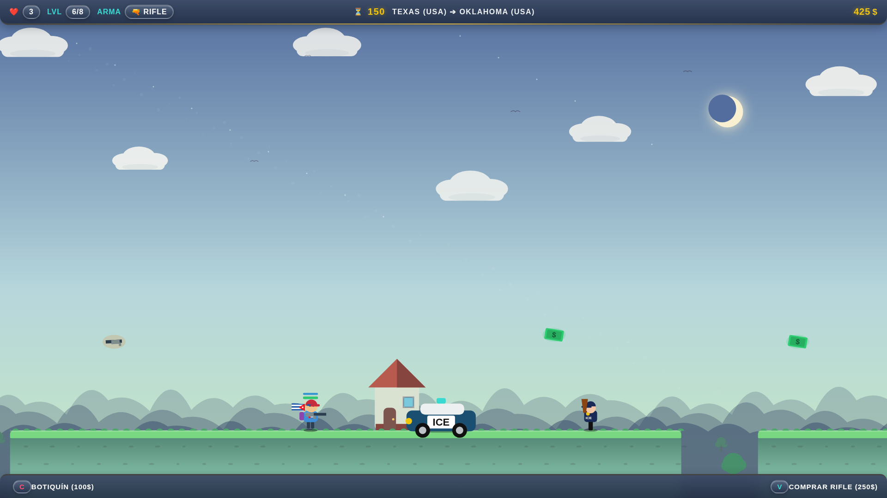
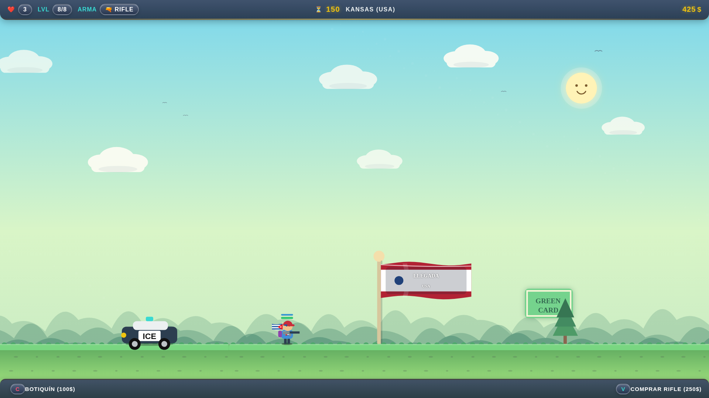

# JUAN SIN VISA

  

  <strong>Plataformas 2D · 8 etapas · Acción y aventura · Web + Windows</strong> 
  <strong>2D platformer · 8 stages · Action & adventure · Web + Windows</strong>

  <a href="https://yottomtnz.github.io/JuanSinVisa/assets/JuaSV.html">🎮 Jugar online / Play online</a>
  ·
  <a href="https://drive.google.com/file/d/1uocg8kTLYVKKQZ0HMll7iWrxIuZKakzq/view?usp=drive_link">⬇️ Descargar / Download</a>
  ·
  <a href="https://yottomtnz.github.io/JuanSinVisa/">🌐 Sitio oficial / Official site</a>

---

## Español

**Juan Sin Visa** es un juego original de plataformas 2D, acción y aventura creado por **Fraudy Martinez Madruga**. Acompaña a Juan en una odisea de ocho etapas desde Cuba hasta Estados Unidos, superando obstáculos, enemigos y fronteras mientras administra dinero, salud y armas temporales.

### Estado actual del juego

- **8 etapas conectadas:** Cuba, Nicaragua, Honduras, Guatemala, México, Texas, Oklahoma y Kansas.
- **Plataformas, saltos y combate** con escenarios que aumentan la presión a medida que avanza la ruta.
- **Economía durante la partida:** recolecta dinero, compra botiquines y adquiere un rifle temporal.
- **Armas temporales** encontradas en cajas o compradas durante el recorrido.
- **Enemigos y situaciones diferentes** según la etapa, incluyendo cambios importantes al entrar en Estados Unidos.
- **Clima y ambientación dinámica**, con variaciones de cielo, lluvia, vegetación y elementos del escenario.
- **Cuenta regresiva por etapa** y sistema de vidas.
- **Controles de teclado y táctiles integrados** en la versión web.
- **Banda sonora** con música para el recorrido y una pista dedicada al final.
- **Pantalla de historia, transiciones, Game Over y secuencia final** integradas en la experiencia.

### 🎮 Controles — versión web

| Acción | Teclado |
|---|---|
| Moverse | `←` `→` o `A` `D` |
| Saltar / continuar | `↑`, `W` o `Espacio` |
| Atacar con un arma equipada | `Z` o `Shift izquierdo` |
| Comprar botiquín (100 $) | `C` |
| Comprar rifle (250 $) | `V` |
| Móvil | Botones táctiles mostrados dentro del juego |

### 🗺️ Ruta

`Cuba → Nicaragua → Honduras → Guatemala → México → Texas → Oklahoma → Kansas`

### 📸 Capturas reales

  
  

  
  

  
  

### ▶️ Tráiler

El tráiler oficial está incluido en `assets/trailer/Trailer_JuanSinVisa_1080p60.mp4` y también puede reproducirse desde el [sitio oficial](https://yottomtnz.github.io/JuanSinVisa/).

### 🖥️ Versión descargable para Windows

La ficha técnica del proyecto indica compatibilidad con **Windows 7 SP1, Windows 10 y Windows 11**. Los requisitos completos están en [`docs/FICHA_TECNICA.md`](docs/FICHA_TECNICA.md).

### 🧰 Tecnología

La edición online funciona con **HTML5 Canvas, JavaScript y HTML5 Audio** directamente en el navegador.

### 👤 Autor y derechos

**Autor / Creador:** Fraudy Martinez Madruga  
**Copyright:** © 2026 Fraudy Martinez Madruga. Todos los derechos reservados.

La publicación del código y de los archivos en este repositorio no concede permiso para redistribuir, vender, relicenciar, atribuirse la autoría ni crear versiones derivadas, salvo donde lo exija la legislación aplicable. Consulte [`LICENSE`](LICENSE).

---

## English

**Juan Sin Visa** is an original 2D platform, action, and adventure game created by **Fraudy Martinez Madruga**. Follow Juan through an eight-stage journey from Cuba to the United States, crossing obstacles, enemies, and borders while managing money, health, and temporary weapons.

### Current build

- **8 connected stages:** Cuba, Nicaragua, Honduras, Guatemala, Mexico, Texas, Oklahoma, and Kansas.
- **Platforming, jumping, and combat**, with increasing pressure as the route progresses.
- **In-run economy:** collect money, buy healing, and purchase a temporary rifle.
- **Temporary weapons** found in item boxes or purchased during the journey.
- **Different enemies and situations** depending on the stage, with major changes after entering the United States.
- **Dynamic atmosphere and weather**, including sky, rain, vegetation, and environmental variations.
- **Per-stage countdown** and a lives system.
- **Built-in keyboard and touch controls** in the web version.
- **Soundtrack** for the journey plus dedicated ending music.
- **Story intro, transitions, Game Over, and ending sequence** integrated into the experience.

### 🎮 Controls — web version

| Action | Keyboard |
|---|---|
| Move | `←` `→` or `A` `D` |
| Jump / continue | `↑`, `W`, or `Space` |
| Attack with an equipped weapon | `Z` or `Left Shift` |
| Buy medkit (100 $) | `C` |
| Buy rifle (250 $) | `V` |
| Mobile | Touch buttons displayed inside the game |

### 🗺️ Route

`Cuba → Nicaragua → Honduras → Guatemala → Mexico → Texas → Oklahoma → Kansas`

### 📸 Real screenshots

  
  

  
  

  
  

### ▶️ Trailer

The official trailer is included at `assets/trailer/Trailer_JuanSinVisa_1080p60.mp4` and can also be watched on the [official site](https://yottomtnz.github.io/JuanSinVisa/).

### 🖥️ Downloadable Windows version

The project technical sheet lists support for **Windows 7 SP1, Windows 10, and Windows 11**. Full requirements are available in [`docs/FICHA_TECNICA.md`](docs/FICHA_TECNICA.md).

### 🧰 Technology

The online edition runs directly in the browser using **HTML5 Canvas, JavaScript, and HTML5 Audio**.

### 👤 Author and rights

**Author / Creator:** Fraudy Martinez Madruga  
**Copyright:** © 2026 Fraudy Martinez Madruga. All rights reserved.

Publishing the code and files in this repository does not grant permission to redistribute, sell, relicense, claim authorship, or create derivative versions except where required by applicable law. See [`LICENSE`](LICENSE).
